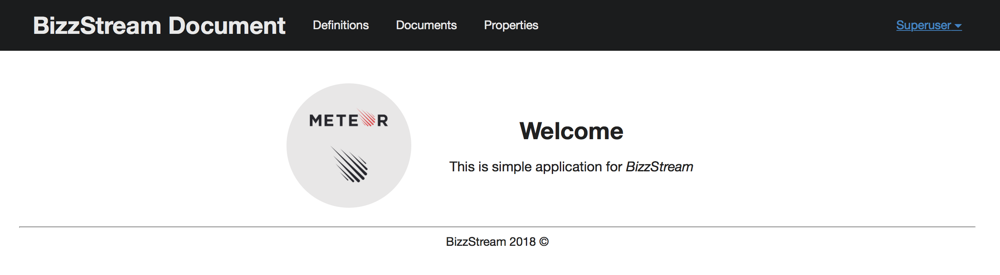

## Installation

1. [Install Meteor](https://www.meteor.com/install).

2. [Clone GitHub repository](https://github.com/alexbereza/documents-bizzstream.git)


```
$ meteor npm install
```

Once the libraries are installed, you can run the application

```
$ meteor npm run start
```

If all goes well, the template application will appear at [http://localhost:3000](http://localhost:3000).  You can login using the credentials in [settings.development.json](https://github.com/ics-software-engineering/meteor-application-template/blob/master/config/settings.development.json), or else register a new account.


Structure:

```
client/
  lib/           # holds Semantic-UI files.
  head.html      # the <head>
  main.js        # import all the client-side html and js files. 
imports/
  api/           # Define collection processing code (client + server side)
  startup/       # Define code to run when system starts up (client-only, server-only, both)
    both/          
    client/        
    server/        
  ui/
    layouts/     # Layouts contain common elements to all pages (i.e. menubar and footer)
    pages/       # Pages are navigated to by FlowRouter routes.
    stylesheets/ # CSS customizations, if any.
node_modules/    # managed by Meteor
public/          # static assets (like images) can go here.
server/
   main.js       # import all the server-side js files.
```

### Preinstalled packages

In a nutshell, meteor-application-template includes support for:

  * Forms (autoform, collection2, check, autoform-semantic-ui )
  * Accounts (accounts-ui, accounts-password and useraccounts:semantic-ui)
  * Routing (flow-router, flow-router-helpers, active-route)
  * Presentation (semantic-ui, spin)
  
It does not provide security (both autopublish and insecure packages) remain enabled. This is intentional.

### Create Docker image
```
    docker build -t "documents-bizzstream:dockerfile" .
```

### Building your Meteor app

Run the following command in the root directory of your meteor app, to build and generate an archive:
```
    docker run --rm -v $(pwd):/app documents-bizzstream:dockerfile build /app
```

### Example Dockerfile of your meteor app
```
FROM node:8.9.4

ENV METEOR_VERSION=1.6.1.1
ENV LC_ALL=POSIX
ENV METEOR_ALLOW_SUPERUSER=1

RUN apt-get -yqq update \
    && DEBIAN_FRONTEND=noninteractive apt-get -yqq install \
        curl \
        g++ \
        make \
    && apt-get clean && rm -rf /var/lib/apt/lists/*

RUN curl "https://install.meteor.com/?release=${METEOR_VERSION}" | /bin/sh

ENV PATH=$PATH:/documents-bizzstream/.meteor
WORKDIR /app
EXPOSE 3000
ENTRYPOINT ["meteor"]
```

### The Assignment

Within BizzStream we use the concept of document definitions. A document definition gives information about the context and workflow of a document. 
```
{
  "header": {
    "rows": [
      {
        "columns": [
          {
            "_id": "cc4cb134-fda0-44d8-8e92-e42ebbceb415",
            "label": "Client Name",
            "name": "name",
            "type": "Text",
            "maxLength": 100
          },
          {
            "_id": "228b905f-4a43-4a40-b829-0c6a04ad4782",
            "label": "Client Age",
            "name": "age",
            "type": "number"
          }
        ]
      }
    ]
  },
  "buttons": [
    "save"
  ]
}
```

This document definition contains 2 fields: The field name is a text field and has the label “Client Name”. The field age is a number field and has the label “Client Age”. BizzStream also has the concept of a layout. A layout determines how a user interacts with a document.
```
{
  "header": {
    "rows": [
      {
        "columns": [
          {
            "fieldId": "cc4cb134-fda0-44d8-8e92-e42ebbceb415"
          },
          {
            "fieldId": "228b905f-4a43-4a40-b829-0c6a04ad4782"
          }
        ]
      }
    ]
  },
  "buttons": [
    "save"
  ]
}
```

This layout shows one row that contains 2 columns: column 1 contains the field name and column 2 contains the field age. Furthermore, the view generates also contains a Save button; which saves a document.
Another BizzStream concept is the view: The view combines information from the layout and document definition

```
{
  "header": {
    "rows": [
      {
        "columns": [
          {
            "_id": "cc4cb134-fda0-44d8-8e92-e42ebbceb415",
            "label": "Client Name",
            "name": "name",
            "type": "Text",
            "maxLength": 100
          },
          {
            "_id": "228b905f-4a43-4a40-b829-0c6a04ad4782",
            "label": "Client Age",
            "name": "age",
            "type": "number"
          }
        ]
      }
    ]
  },
  "buttons": [
    "save"
  ]
}
```

### Application functionality

The application for BizzStream 

#### Home page

Implemented by the Home_Page template. 



### Definitions

---

### Documents

---

### Properties (Fields)

---

You must login to access any page other than the Home page. 


### Testing
Application has Tests which you can RUN 
```
meteor test --driver-package meteortesting:mocha --port 3100
```


### Links
```
Developers guide - https://guide.meteor.com
Packages         - https://atmospherejs.com/
Testing          - https://guide.meteor.com/testing.html
                 - https://www.meteor.com/tutorials/blaze/testing

Semantic UI      - https://semantic-ui.com

Tutorials        - http://www.meteor-tutorial.org/book
                 - http://meteortips.com/first-meteor-tutorial/
                 - https://angular-meteor.com/api/angular2-meteor/latest/Meteor-RxJS
```

### License
[FeeBSD License](https://en.wikipedia.org/wiki/BSD_licenses)